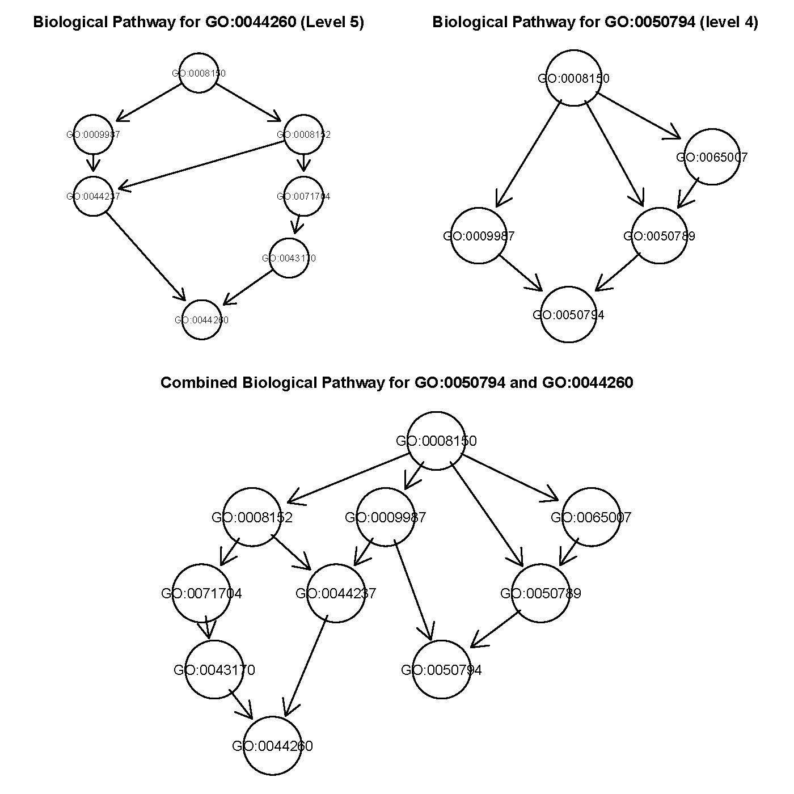

# Jellyfishtest
Codes on jellyfish poison data

Open BoxJellyFish.R 

I tried to workout GO Groupings using pubilically avaliable summary data. If you want raw data you must request it from original research. https://www.nature.com/articles/s41467-019-09681-1. The study is very interesting. 

The primary goal is simpliy to see if I can form grouping (not working out Gene Enrichment Score from summary data), so a simple proportion count was used to rank most "significant" groupings. I Will try gese function from Bioconductor package "phenoTest" if I had time and see how results compare to the original study. 

